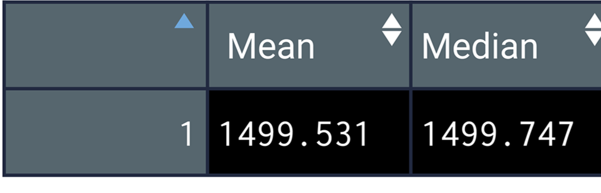

# MechaCar_Statistical_Analysis

# Deliverables 
    
    
**Deliverable 1 Requirements**

The MechaCar_mpg.csv file is imported and read into a dataframe

An RScript is written for a linear regression model to be performed on all six variables

An RScript is written to create the statistical summary of the linear regression model with the intended p-values

There is a summary that addresses all three questions

----

    
    
**Deliverable 2 Requirements**

The Suspension_Coil.csv file is imported and read into a dataframe

An RScript is written to create a total summary dataframe that has the mean, median, variance, and standard deviation of the PSI for all manufacturing lots

An RScript is written to create a lot summary dataframe that has the mean, median, variance, and standard deviation for each manufacturing lot

There is a summary that addresses the design specification requirement for all the manufacturing lots and each lot individually

----

----

    
    
**Deliverable 3 Requirements**

An RScript is written for t-test that compares all manufacturing lots against mean PSI of the population

An RScript is written for three t-tests that compare each manufacturing lot against mean PSI of the population

There is a summary of the t-test results across all manufacturing lots and for each lot

----

----

**Deliverable 4 Requirements**

- A metric to be tested is mentioned

Safety Feature Rating: Independent Variable
Current Price (Selling): Dependent Variable
Drive Package : Independent Variable
Engine (Electric, Hybrid, Gasoline / Conventional): Independent Variable
Resale Value: Independent Variable
Average Annual Cost of ownership (Maintenance): Independent Variable
MPG (Gasoline Efficiency): Independent Variable

- A null hypothesis or an alternative hypothesis is described

Null Hypothesis (Ho): MechaCar is priced correctly based on its performance of key factors for its genre.
Alternative Hypothesis (Ha): MechaCar is NOT priced correctly based on performance of key factors for its genre.

- A statistical test is described to test the hypothesis

A multiple linear regression would be used to determine the factors that have the highest correlation/predictability with the list selling price
